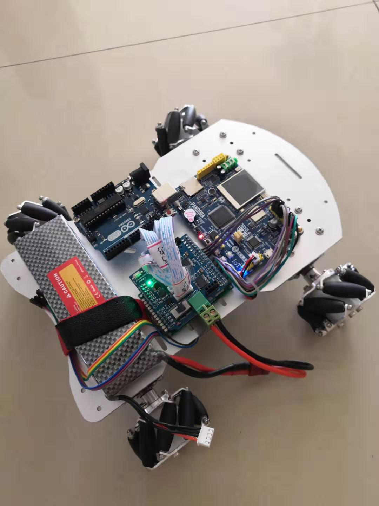
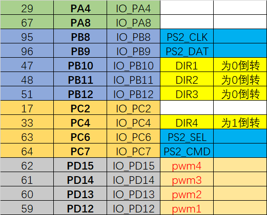
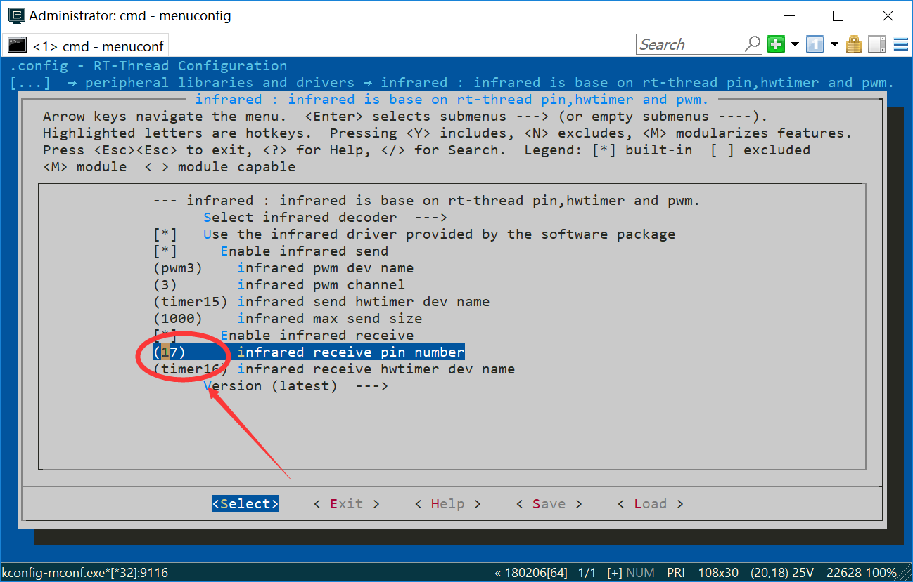
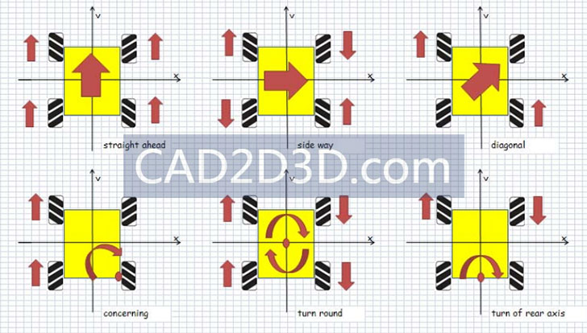
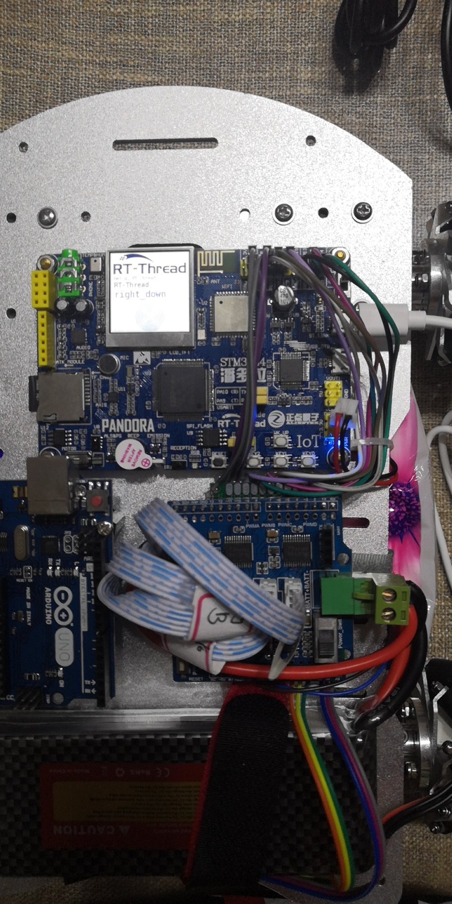

# [ 一起 DIY 智能战车 ]
## 1. 软硬件环境准备

1. 硬件底盘+驱动+电池
蓝牙APP控制全向轮智能小车PS2遥控麦克纳姆轮底盘万向轮避障小车 颜色分类：全套底盘(含手柄电控电池套件)
该套件物件齐全，仅需要替换主控，就能实现功能。
且麦克纳姆轮底盘操控灵活，方便室内运行。


2. 主控： 潘多拉IoT Board物联网开发板 


3. 软件：RT-Thread 3.1.3

## 2. 移植工程
到官网下下载 RT-Thread 3.1.3，env。
安装好 IAR 和 MDK。

指定了编译工具使用 iar，并设置了 iar 安装路径， 按照自己电脑的实际路径
设置，iar 安装路径是 D:\Program Files (x86)\IAR Systems\Embedded Workbench 8.1
将路径设置为： r'D:\Program Files (x86)\IAR Systems\Embedded Workbench 8.1' 或者： 'D:/Program Files (x86)/IAR Systems/Embedded Workbench 8.1'，
即使用‘/’时不用在路径前加‘r’ ,使用‘\’时需要在路径前加‘r’。
设置好 iar 路径后，右键打开 evn 的 cmd 命令行窗口，将工作目录切换到  \rt-thread\bsp\stm32\stm32l475-atk-pandora 目录，输
入 scons –j4 命令，即可开始构建编译工程。
构建工程用命令： scons --target=iar 

## 3. 等待硬件到来开始写程序

硬件来了，期间隔了一个智能车竞赛，还有一个机器人培训。结束后，装车，如图：


为了测试和对比，留了arduino主控板，在旁边安装了 IoT_Board。

## 4. 引脚 分配




## 5. 遥控功能实现
移植红外遥控部分程序，由于 drv_gpio更新，导致引脚号更换，查错一天后，将红外接收引脚由原来的 36 更换为 17 后正常。
原来 36 是 管脚号，现在的 17 意思是B1, 即如果 
```
A0 - 0
A1 - 1
...
A15 - 15

B0 - 16
B1 - 17
...
C0 - 32
C1 - 33
...

```
以此类推。
红外接收引脚修改如图：



## 6.编写控制 麦轮 的程序
麦轮 的运转控制如图：


程序代码编写 与 红外接收数据 关系：
```
#define left            0x22
#define down            0xA8
#define right           0xC2
#define left_up         0xA2
#define right_up        0xE2
#define left_down       0xE0
#define right_down      0x90

#define stop1           0x02
#define stop2           0x98
#define stop3           0x18
#define stop4           0x38

#define turn_left_up    0x68
#define turn_left_mid   0x30
#define turn_left_down  0x10
#define turn_left       0x42

#define turn_right_up   0xB0
#define turn_right_mid  0x7A
#define turn_right_down 0x5A
#define turn_right      0x52

```
## 7. 添加液晶显示
在 env 中配置后，重新生成工程。
在 main.c 中添加显示代码：
```
void lcd_dis(void)
{
     /* 清屏 */
    lcd_clear(WHITE);
    /* 显示 RT-Thread logo */
    lcd_show_image(0, 0, 240, 69, image_rttlogo);
    
    /* 设置背景色和前景色 */
    lcd_set_color(WHITE, BLACK);

    /* 在 LCD 上显示字符 */
    lcd_show_string(10, 69, 16, "Hello, RT-Thread!");
    lcd_show_string(10, 69+16, 24, "RT-Thread");
    lcd_set_color(WHITE, BRED);
    lcd_show_string(10, 69+16+24, 32, "RT-Thread");
    
    /* 在 LCD 上画线 */
    lcd_set_color(WHITE, BLUE);
    lcd_draw_line(0, 69+16+24+32, 240, 69+16+24+32);
    
    /* 在 LCD 上画一个同心圆 */
    lcd_draw_point(120, 194);
    for (int i = 0; i < 46; i += 4)
    {
        lcd_draw_circle(120, 194, i);
    }
}
```

后面，在对应的按键代码处添加 ：
```
              case  left_down:
                function_left_down(speed);
                lcd_show_string(10, 69+16+24, 32, "left_down        ");
                break;              

```



## 8. 红外遥控器 控制麦轮小车运行结果


**目前第一阶段遥控功能完成，基于 IoT_Board 上的红外遥控器，实现麦轮小车 的多向运行。**

后期  **打算用 手柄遥控 、网络远程控制 、声音控制** 。


