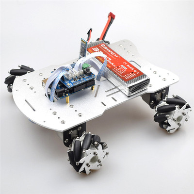
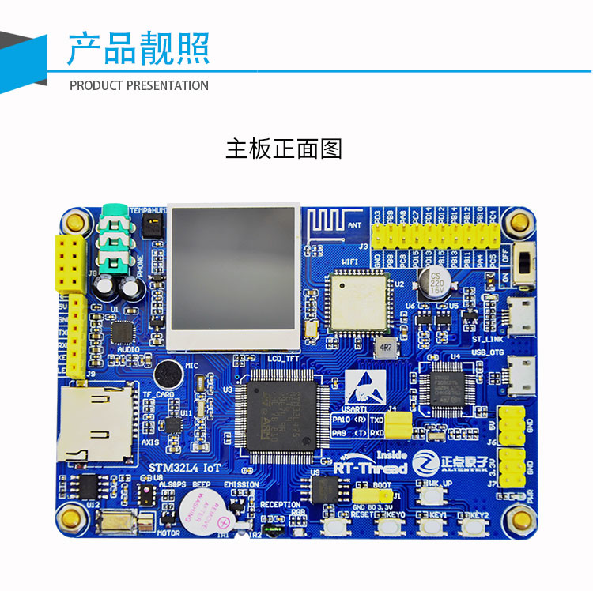

# [ 一起 DIY 智能战车 ]
## 1. 软硬件环境准备

1. 硬件底盘+驱动+电池
蓝牙APP控制全向轮智能小车PS2遥控麦克纳姆轮底盘万向轮避障小车 颜色分类：全套底盘(含手柄电控电池套件)
该套件物件齐全，仅需要替换主控，就能实现功能。
且麦克纳姆轮底盘操控灵活，方便室内运行。

2. 主控： 潘多拉IoT Board物联网开发板 

3. 软件：RT-Thread 3.1.3

## 2. 移植工程
到官网下下载 RT-Thread 3.1.3，env。
安装好 IAR 和 MDK。

## 3. 等待硬件到来开始写程序

